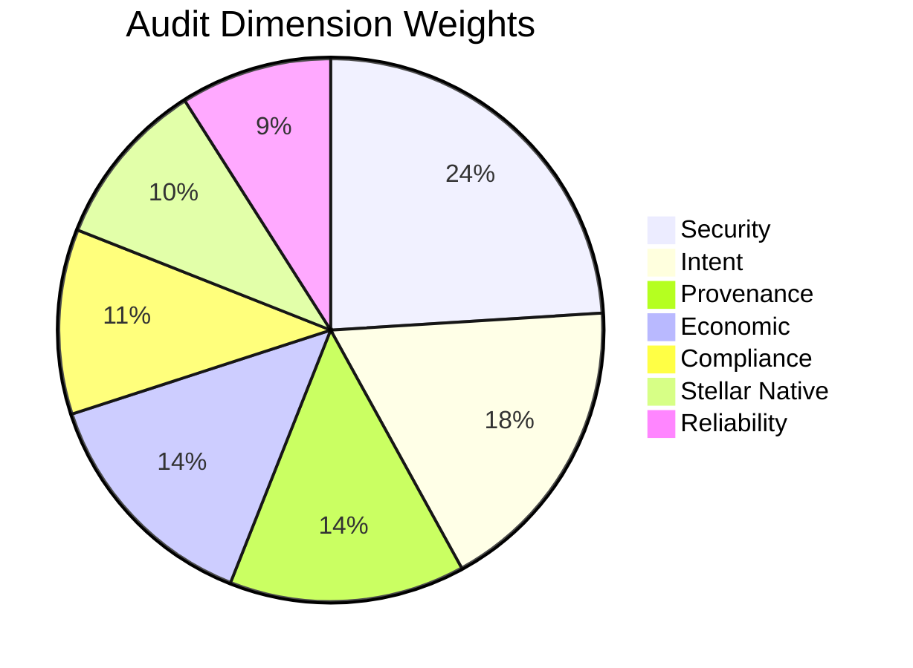
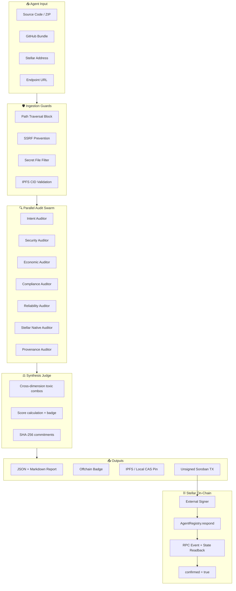

<p align="center">
  
</p>

<h1 align="center">AgentVeritas Stellar</h1>

<p align="center">
  <strong>Evidence-first verification engine for AI agents on the Stellar network.</strong><br>
  Review an agent's code, permissions and behavior claims before granting it authority.
</p>

<p align="center">
  
  
  
  
</p>

---

## Table of Contents

- [Why AgentVeritas?](#why-agentveritas)
- [Audit Studio](#audit-studio)
- [How It Works](#how-it-works)
- [System Architecture](#system-architecture)
- [Soroban Smart Contracts](#soroban-smart-contracts)
- [Stellar Testnet Deployment](#stellar-testnet-deployment)
- [SEP Standards Integration](#sep-standards-integration)
- [Quick Start](#quick-start)
- [Evidence Levels](#evidence-levels)
- [Project Structure](#project-structure)
- [Documentation](#documentation)
- [Contributing](#contributing) · [Security](#security) · [License](#license)

---

## Why AgentVeritas?

AI agents can now hold wallets, sign transactions and invoke smart contracts autonomously. But **a convincing demo says nothing about what happens when tool output is hostile, approval is missing, or a dependency changes**. An address and a reassuring prompt are not enough.

AgentVeritas examines the actual source code, tool permissions, prompts, dependencies, ownership proofs and on-chain data — then produces a verifiable, hash-committed report anchored to the Stellar ledger.

---

## Audit Studio

The public Studio at `/` offers three intake methods — no wallet connection or API key required:

| Intake | What it does |
|---|---|
| **Stellar Address** | Read-only Testnet/Mainnet lookup via Horizon + RPC (no signing) |
| **GitHub Import** | Fetches root `agent-audit.json` from a public repo (bounded, no clone) |
| **File Upload** | Direct source bundle upload for offline analysis |

The Studio runs seven **rule-based static analysis modules** across all submitted source. Files are never executed, persisted or sent to external AI services. Reports include file:line evidence, coverage metrics, input-commitment SHA-256 and an exact-byte downloadable report.

> The operator workflow at `/operator` provides the full persistent pipeline with authentication, stored jobs, badges and Soroban integration.

See: [Audit Studio API](docs/AUDIT_STUDIO.md) · [Product & Pilot](docs/PRODUCT_AND_PILOT.md) · [Verification Record](docs/VERIFICATION_2026-09-11.md)

---

## How It Works

Every agent is examined across **seven independent dimensions**, each with a calibrated weight:



| Dimension | Focus | Weight |
|---|---|---:|
| **Security** | Code vulnerabilities, injection paths, secret leakage | 24% |
| **Intent** | Behavioral alignment, prompt honesty, harmful patterns | 18% |
| **Provenance** | Source origin, dependency supply-chain, commit history | 14% |
| **Economic** | Spend limits, financial controls, fund-loss paths | 14% |
| **Compliance** | OFAC screening, regulatory alignment, disclosure | 11% |
| **Stellar Native** | Trustlines, signing authority, SEP usage, on-chain behavior | 10% |
| **Reliability** | Error handling, retry logic, idempotency, fault tolerance | 9% |

### Evidence Grading

Not all findings carry equal certainty. Each finding is graded:

| Grade | Meaning | Score Multiplier |
|---|---|---:|
| `CONFIRMED` | Direct code evidence with file:line reference | 1.0× |
| `INFERRED` | Absence of a defense (static inference) | 0.6× |
| `SIMULATED` | Derived from simulated/mocked chain data | 0.35× |

**Quorum rules:** Exactly 7 unique auditor identities must report. Timeout, identity mismatch or duplicate finding IDs fail-close the audit. If no external data provider exists, results are not fabricated — `SAFE` is never granted without verified ownership + real RPC binding.

---

## System Architecture



### DEEP Tier Analysis

For high-risk agents, the engine traces executable data paths:

| Trace | Source → Sink |
|---|---|
| **Code Injection** | API/webhook input → `eval`, `exec`, shell, subprocess |
| **Unauthorized TX** | External input → Stellar `invoke_contract`, token transfer, signing |
| **Secret Leakage** | Private key / seed → log output, outbound HTTP request |
| **Unenforced Controls** | Prompt claims spending limits → code has no `require_auth` or allowlist |

Cross-dimension toxic combinations (e.g., network access + code execution + Stellar signing) are flagged by the Synthesis Judge and enforce a score ceiling that dimension averages cannot mask.

> See [DEEP Agent Audit Methodology](docs/DEEP_AGENT_AUDIT.md)

---

## Soroban Smart Contracts

### AgentRegistry (Core)

The trust anchor on Stellar. Stores agent identity, audit results and review scores immutably.

| Feature | Detail |
|---|---|
| Registration | Owner-bound, versioned, active/inactive toggle |
| Validation | Pinned validator per request; single response with score + 32-byte report hash + URI |
| Reviews | Unique reviewer enforcement; checked arithmetic for score aggregation |
| Auth | `Address.require_auth()` for both G and C accounts |
| Standards | SEP-46 metadata + SEP-48 contract spec embedded |
| Storage | TTL renewal on read/write; URI capped at 512 bytes; typed contract events |

### AuditEscrow (Optional)

Independent from the verification core. Provides decentralized audit payment settlement using SAC tokens.

| Feature | Detail |
|---|---|
| Roles | Requester / Provider / Evaluator — strictly separated |
| Lifecycle | Create → Fund → Submit → Complete (or Refund / Dispute) |
| Fees | Platform fee in basis points (max 30%); atomic payout |
| Asset | SEP-41 Stellar Asset Contract client |

> **Security boundary:** The backend never stores seeds, never signs transactions, never submits them. `confirmed=true` is only set when a successful ledger result **and** expected registry state/event are verified together.

---

## Stellar Testnet Deployment

Deployed August 30, 2026. Re-verified September 11, 2026 — all **31 checks** passed.

| Contract | Testnet ID | Verification |
|---|---|---|
| **AgentRegistry** | `CBBBUE...576KT` | WASM hash match ✓ Deploy tx SUCCESS ✓ Role/lifecycle readback ✓ |
| **AuditEscrow** | `CD6Q7D...7KH7W` | WASM hash match ✓ Deploy tx SUCCESS ✓ Funded lifecycle readback ✓ |
| **Test Asset** | `CDLZFC...GCYSC` | Native XLM SAC (not USDC) |

Lifecycle proven: `register → request → respond → review` (Registry) and `create → fund → submit → complete` with real 1 XLM flow (Escrow).

Full manifest: [`deployments/stellar-testnet.json`](deployments/stellar-testnet.json)

---

## SEP Standards Integration

| Standard | Status | Usage in AgentVeritas |
|---|---|---|
| **SEP-53** | ✅ Final | G-account off-chain ownership proof (Ed25519 + SHA-256) |
| **SEP-46** | ✅ Active | Contract metadata embedding |
| **SEP-48** | ✅ Active | Generated contract interface / spec |
| **SEP-10** | 🔧 Planned | G/M account web session auth |
| **SEP-45** | 📝 Draft | C-account web auth (complementary to contract auth) |
| **SEP-41** | 📝 Draft | SAC token interface for optional escrow |
| **SEP-1** | 🔧 Planned | Service discovery (no published `stellar.toml` yet) |
| **SEP-55/58** | 👁️ Tracked | Future build verification / reproducibility |

> Detailed rationale: [Stellar Architecture Decision](docs/STELLAR_ARCHITECTURE_DECISION.md)

---

## Quick Start

```bash
# 1. Setup
python3 -m venv .venv
.venv/bin/pip install -r backend/requirements-dev.txt
test -f .env || cp .env.example .env

# 2. Run tests (offline, no external services)
STELLAR_NETWORK=offline ALLOW_MAINNET=false \
ENABLE_AUDIT_ESCROW=false LLM_PROVIDER= LLM_API_KEY= PINATA_JWT= \
.venv/bin/python -m pytest -q

# 3. Soroban contracts
cargo fmt --check
cargo clippy --workspace --all-targets -- -D warnings
cargo test --workspace
cargo build --workspace --target wasm32v1-none --release

# 4. Dev server
./scripts/dev.sh
# Studio:   http://127.0.0.1:8000/
# Operator: http://127.0.0.1:8000/operator
# API:      http://127.0.0.1:8000/api/v1
```

### Testnet Verification
```bash
.venv/bin/python -m backend.deploy verify-testnet
.venv/bin/python -m backend.cli events-sync --start-ledger 4419257
.venv/bin/python -m backend.cli chain
```

---

## Evidence Levels

| Level | Proves | Does NOT Prove |
|---|---|---|
| Static / local tests | Code paths and invariants | Deployment or funded tx |
| WASM build + hash | Compilable artifact | Same as explorer contract |
| Testnet contract ID | An ID is configured | Code/hash match or state |
| Successful tx + readback | Specific call + expected effect | Mainnet / production safety |
| Funded end-to-end | Real asset lifecycle | Safety under all adversarial conditions |

---

## Project Structure

```text
agentveritas-stellar/
│
├── backend/                    # Python audit engine (FastAPI)
│   ├── app/
│   │   ├── api.py              # REST API (Studio + Operator endpoints)
│   │   ├── models.py           # Domain models, enums, evidence grades
│   │   ├── config.py           # Settings & environment binding
│   │   ├── studio_guard.py     # Studio admission limits
│   │   ├── swarm/              # 7 auditors + synthesis judge + orchestrator
│   │   │   ├── intent.py       #   Intent & behavioral analysis
│   │   │   ├── security.py     #   Code vulnerability scanning
│   │   │   ├── economic.py     #   Financial control verification
│   │   │   ├── compliance.py   #   OFAC & regulatory screening
│   │   │   ├── reliability.py  #   Fault tolerance & error handling
│   │   │   ├── stellar_native.py # Stellar-specific checks
│   │   │   ├── provenance.py   #   Supply-chain & origin analysis
│   │   │   ├── judge.py        #   Cross-dimension synthesis
│   │   │   ├── orchestrator.py #   Parallel execution & quorum
│   │   │   ├── agentic_paths.py#   DEEP tier data-path tracing
│   │   │   └── scenarios.py    #   Attack scenario simulation
│   │   ├── stellar/            # Stellar identity, ownership, RPC, events
│   │   ├── ingestion/          # Secure input (SSRF/path guards)
│   │   ├── services/           # Pipeline, escrow, badges, self-test
│   │   ├── reporting/          # JSON/Markdown/IPFS report generation
│   │   └── compliance/         # OFAC sanctions screening
│   └── tests/                  # 27 test modules
│
├── contracts/                  # Soroban smart contracts (Rust)
│   ├── agent-registry/         #   Core registry (13 tests)
│   └── audit-escrow/           #   Optional escrow (7 tests)
│
├── frontend/                   # Web UI
│   ├── studio.html / .js / .css  # Public Audit Studio
│   └── index.html / app.js      # Operator console
│
├── examples/                   # Test agent corpus
│   ├── safe_agent/             #   Clean reference agent
│   ├── vulnerable_agent/       #   Deliberately unsafe agent
│   └── corpus/                 #   6 diverse benchmark agents
│
├── scripts/                    # Dev, test, deploy, benchmark utilities
├── docs/                       # Architecture decisions & audit reports
├── deployments/                # Testnet deployment manifest
└── .env.example                # Environment variable template
```

---

## Documentation

| Document | Description |
|---|---|
| [Product & Pilot](docs/PRODUCT_AND_PILOT.md) | Users, upload flow, revenue hypotheses, 30-day scope |
| [Audit Studio API](docs/AUDIT_STUDIO.md) | Bundle format, limits, exact-byte report verification |
| [Verification 2026-09-11](docs/VERIFICATION_2026-09-11.md) | Latest changes, evidence, remaining release gates |
| [Stellar Architecture](docs/STELLAR_ARCHITECTURE_DECISION.md) | SEP choices and system design rationale |
| [DEEP Agent Audit](docs/DEEP_AGENT_AUDIT.md) | DEEP tier analysis methodology |
| [Agent Benchmarks](docs/AGENT_BENCHMARK_2026-09-11.md) | Corpus scoring results and discrimination tests |
| [Audit Report](docs/AUDIT_2026-08-30.md) | Historical findings and evidence matrix |
| [Deployment Manifest](deployments/stellar-testnet.json) | Full transaction / ledger / event evidence |

---

## Contributing

See [CONTRIBUTING.md](CONTRIBUTING.md) for guidelines.

## Security

See [SECURITY.md](SECURITY.md) for responsible disclosure policy.

## License

Apache 2.0 — see [LICENSE](LICENSE).

---

<p align="center">
  <sub>Built for the Stellar ecosystem · No cross-chain dependencies · Independence verified via <code>scripts/verify_independence.sh</code></sub>
</p>
