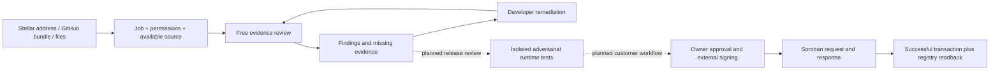

# AgentVeritas: product and pilot

Decision date: 2026-09-11. This document distinguishes the implemented prototype from the proposed paid pilot.

## One sentence

AgentVeritas helps Stellar developers inspect an agent's permissions, identify risky source paths, and build a verifiable audit record before granting it authority.

## The problem and first customer

Agent frameworks make it easy to connect language-model output to tools, keys and transactions. A convincing demonstration says little about what happens when tool output is hostile, approval is missing, a request is replayed or a dependency changes. An address and a reassuring prompt are not enough to assess these boundaries.

Start with teams building Stellar treasury, payment and wallet assistants. Their concrete decision is: **which capabilities may this agent receive, for this version, under this policy?** Do not position the product as a universal truth detector, investment rating, legal certification or replacement for a smart-contract audit.

## Customer journey

Solid Studio flow is implemented. The registry/operator building blocks exist separately; the dotted customer flow is not yet an end-to-end self-service product.

### 1. Submit a version, not just an address

The public Studio offers three entry points: a checksum-valid public G/C Stellar address, a public GitHub repository containing a root `agent-audit.json`, or uploaded source/bundle files. Users describe the job and select capabilities; exact system instructions and tool JSON remain available under advanced inputs. Read-only address lookup supports Testnet and Mainnet, without requesting a private key. An address-only submission clearly reports missing source evidence. Files are treated as untrusted text; no program is executed. An endpoint or wallet address alone cannot reveal the implementation or justify a trust score.

The operator path additionally supports repository/ZIP ingestion and ownership evidence. Public remote cloning and active probing are deliberately not exposed by the Studio. A paid runtime submission should eventually include a pinned image digest, adapter contract, test-only credentials, budget and explicit authorization to test the endpoint.

### 2. Inspect evidence, not a decorative badge

Current source review covers seven dimensions. It returns file/line evidence, inferred observations, remediation, coverage, input commitment, policy version and an exact-byte report hash. Directly evidenced high/critical source findings are separated from unverified ownership and other evidence gaps.

Python analysis is intraprocedural, does not resolve arbitrary dynamic dispatch or cross-file behavior, and conservatively joins branches. A process-call path is not necessarily shell injection. A secret-to-network path needs sink interpretation. Static keyword checks do not prove a defense works at runtime. Unknown does not mean safe.

### 3. Verify behavior in a bounded environment — next build stage

The isolated runner is **not implemented** in this release. Its minimum contract should be:

| Boundary | Required experiment | Observable result |
|---|---|---|
| Prompt/tool isolation | Inject instructions in tool results and conversation turns | Unauthorized tool calls, not the agent's self-reported refusal |
| Signing authority | Change recipient, amount and contract/function after approval | Rejected signing attempt; no unexpected transaction |
| Spending | Exceed per-action and cumulative budgets; exercise parallel calls | Rejected excess and conserved budget |
| Replay | Duplicate request, stale authorization and retry after timeout | At most one intended payment effect |
| Secrets | Place canaries in the test-only environment | No canary in logs, responses or outbound requests |
| Recovery | Timeout, malformed tool output and dependency failure | Bounded retries and no duplicate side effect |
| Task fitness | Run task-specific expected-result fixtures | Correct result or explicit abstention, with reasons |

Each run must record the image/input/policy hashes, tool-call trace, network policy, fixtures and outcomes. Use an unprivileged ephemeral sandbox with no host mounts, production keys or unrestricted egress, CPU/memory/time/output limits, and a separate signer policy. Do not execute arbitrary user code in the API process. Attested runtime evidence must say which tests ran, not claim all possible failures were tested.

### 4. Bind the record to Stellar

Use Soroban for owner authorization, assigned validators, report commitments and a review trail. Keep source, prompts and detailed findings offchain. The existing registry and optional native-XLM SAC escrow have Testnet lifecycle evidence. Current local rule modules share an operator and are not a decentralized auditor network.

A registry-v2 milestone must pin the agent version and metadata/input commitment at request time. The existing `ValidRec` stores agent ID and report hash, but does not snapshot the agent version; do not infer that an old review approves the latest metadata. A report hash establishes integrity, not truth. Independent reviewers, key governance, revocation and reassessment rules remain important.

## Stellar-native choices

| Primitive / standard | Product role | Current boundary |
|---|---|---|
| Soroban `require_auth` | Enforce owner, validator and reviewer authorization | Implemented in the registry; retain negative-auth tests and independent contract review as gates |
| SEP-53 | Network-bound G-account ownership-message proof | Implemented; not a session, multisig authorization or permission to transfer funds |
| SEP-10 | Wallet-backed web sessions for G/M accounts | Planned before multi-tenant persisted customer accounts |
| SEP-45 | Contract-account web authentication | Planned; use a conforming flow, not raw C-account signature recovery |
| SEP-1 | Domain service discovery | Planned after the domain and real endpoints are selected; do not advertise absent auth services |
| SEP-46 / SEP-48 | Metadata and contract interface inspection | Existing contract artifacts |
| SAC / SEP-41 interface | Optional fee escrow, refund and payout | Native-XLM Testnet evidence exists; no live USDC checkout is claimed |
| RPC events + persistent indexer | Reconcile an audit response with transaction and expected state | Existing local event store; hosted retention/lag operations remain a gate |

SEP-10 is Active, SEP-53 Final, and SEP-45/SEP-41 Draft in the [official SEP directory](https://github.com/stellar/stellar-protocol/blob/master/ecosystem/README.md), checked 2026-09-11. [SEP-53](https://github.com/stellar/stellar-protocol/blob/master/ecosystem/sep-0053.md), [SEP-10](https://github.com/stellar/stellar-protocol/blob/master/ecosystem/sep-0010.md) and [SEP-45](https://github.com/stellar/stellar-protocol/blob/master/ecosystem/sep-0045.md) serve different signing/authentication purposes.

Do not add anchor KYC, cross-border payout or token issuance merely to increase the SEP count. SEP-24/31/38 are not needed for the first agent-review customer. Stellar [agentic payments](https://developers.stellar.org/docs/build/agentic-payments) may later support machine-paid review API calls; x402/MPP payment authentication is not evidence that the paying agent is trustworthy.

## Revenue: sell measured work, never a favorable result

These are testable pricing hypotheses, **not an active checkout or proven revenue**.

| Offer | Initial hypothesis | What the buyer receives |
|---|---|---|
| Source review | Free, bounded usage | Developer onboarding, source findings, portable report |
| Automated release review | 49 USDC per pinned agent version | Fixed adversarial test budget, traces, one remediation rerun and a version-bound Stellar record |
| Team plan | 149 USDC/month, up to 10 bounded automated reviews | Version comparisons, CI integration and change alerts; overages agreed in advance |
| Independent human review | Separately scoped and quoted | Named reviewer, explicit scope and review rationale |

Do not include unbounded model calls or human review at these automated prices. Measure inference, isolated-runner, storage and support cost per review before selling. Target direct variable costs below 30% of automated review revenue as an internal hypothesis, not a present margin. Take payment for the agreed workload regardless of the resulting risk rating. No pass-to-pay incentives, paid removal of findings, safety guarantees or source-data resale.

Future production settlement can use an issuer-verified Stellar asset through SAC, after a separate funded lifecycle. Use explicit asset code **and issuer/contract**, integer base units, signed quote expiry and refund terms. The current test asset is native XLM, not USDC. No custom token is needed.

## Proposed Instawards sprint

The [official rules](https://stellar.gitbook.io/scf-handbook/scf-awards/instawards/official-rules) describe a chapter-led process and a concrete, typically 30-day scope. Initial awards commonly fall in the $1,000–$5,000 range paid in XLM; eligibility, chapter engagement, KYC and approval are not established by this repository. Confirm the scope with a Chapter Lead. No application has been submitted by this work.

Proposed request: **$5,000 for a 30-day evidence-backed Stellar agent-review pilot**, subject to chapter agreement.

| Milestone | Allocation hypothesis | Acceptance evidence |
|---|---:|---|
| Week 1: reproducible pilot intake | $1,000 | Hosted HTTPS Studio; two independent developers submit versioned bundles; consent and retention rules documented |
| Week 2: bounded runtime harness | $1,500 | At least 20 labeled positive/negative fixtures spanning the seven runtime boundaries; raw traces and false-positive/false-negative results published |
| Week 3: version-bound Stellar proof | $1,500 | Testnet registry-v2 request pins version/input commitment; external owner and validator signatures; negative auth/replay/version tests; exact report download matches the committed hash |
| Week 4: pilot and handoff | $1,000 | Three consenting third-party agent versions reviewed; reviewer feedback, reproducible demo and remediation comparison published |

Primary explorer-verifiable KPI: **three distinct third-party agent versions with a successful Testnet audit-response transaction whose report hash matches the downloadable evidence file**. Also publish test coverage, false positives/negatives and unresolved findings. Fixtures are not third-party users; baseline Testnet transactions are not new sprint deliverables; generated IDs or prepared calls do not count.

## Honest current limits

The Studio is local, not a deployed public service. Persisted storage is single-operator, not multi-tenant. The sandbox, CI subscription, wallet-session login, registry-v2 version binding, public domain, independent auditor governance and paid checkout remain implementation work. Some legacy module diagnostics are Turkish; the Studio shell and new source-path diagnostics are English. The compliance module's old legal mappings need specialist review and must not be sold as legal classifications.
